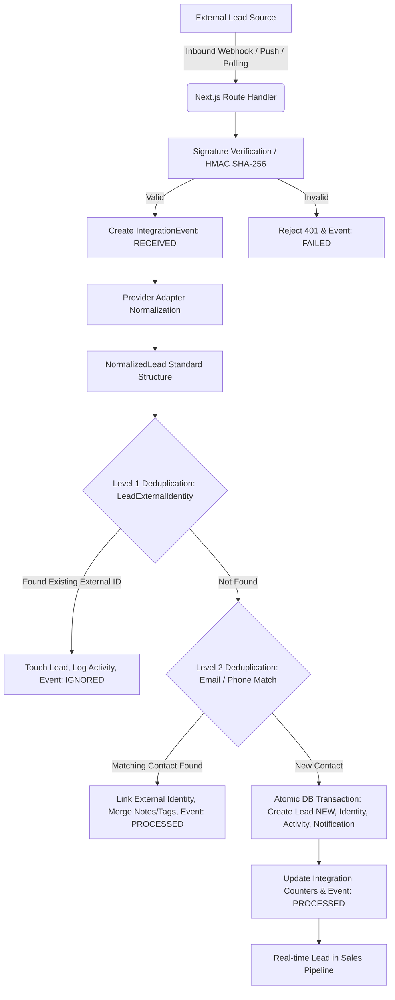

# NEXORA CRM — Lead Ingestion Engine & Connector Architecture

## 1. Architectural Overview

NEXORA's Lead Ingestion Engine is a high-throughput, enterprise-grade data pipeline designed to ingest, verify, normalize, deduplicate, and persist leads in real time across advertising channels, B2B marketplaces, property portals, and custom API webhooks.



---

## 2. Supported Lead Providers & Schemas

| Provider | Ingestion Type | Verification Method | Default Source Tag | Sample Inbound Event |
| :--- | :--- | :--- | :--- | :--- |
| **Facebook Lead Ads** | Push Webhook | `X-Hub-Signature-256` (HMAC SHA-256) | `FACEBOOK` | Meta Instant Form Submission |
| **IndiaMART** | Push / Pull API | `X-IndiaMART-Key` / Bearer Token | `INDIAMART` | B2B Buyer RFQ / Direct Inquiry |
| **99acres** | Webhook / API | `X-Api-Key` / Bearer Token | `NINETY_NINE_ACRES` | Property Buyer Inbound Inquiry |
| **Housing.com & Makaan** | Webhook Bridge | `X-Housing-Signature` (HMAC SHA-256) | `HOUSING` | Verified Home Buyer Request |
| **Google Ads** | Webhook Push | `google_key` verification | `GOOGLE_ADS` | Search & Discovery Lead Extension |
| **Website Forms** | REST JSON Endpoint | Form Public Key / CORS | `WEBSITE` | Landing Page & Pricing Submissions |
| **WhatsApp Business API** | Cloud API Webhook | `X-Hub-Signature-256` / Meta Challenge | `WHATSAPP` | Inbound Chatbot Conversation |
| **Custom Webhooks** | Universal REST API | `X-Nexora-Signature` (HMAC SHA-256) | `OTHER` | Zapier, Make, n8n, Custom Systems |

---

## 3. Cryptography & Security Model

1. **AES-256-GCM Encryption**:
   - All external API keys, developer tokens, app secrets, and webhook secrets are encrypted server-side using `AES-256-GCM` before persistence in the `Integration.encryptedSecrets` column.
   - Master key is derived using SHA-256 on `process.env.ENCRYPTION_KEY` or `process.env.AUTH_SECRET`.
   - Never exposes raw secrets in client bundles or server responses (masked as `••••••••1234`).

2. **Timing-Safe HMAC Verification**:
   - Webhook signatures are verified using `crypto.timingSafeEqual()` to guard against side-channel and timing attacks.

---

## 4. Deduplication Strategy

The Lead Ingestion Engine enforces a rigorous 2-level deduplication hierarchy to prevent duplicate leads and sales rep collisions:

1. **Level 1 — External Identity**:
   - Matches `(workspaceId, provider, externalId)` against the `LeadExternalIdentity` table.
   - If an event is re-delivered by Meta or IndiaMART with the same ID, the system records an audit activity and marks the event `IGNORED` without creating a new lead.

2. **Level 2 — Contact Match (Email / Phone)**:
   - If the external ID is new, the engine searches the `Lead` table for matching `email` or `phone` within the same workspace.
   - If found, the contact is enriched: the new external identity is linked, additional notes and campaign tags are merged, and an audit timeline entry is added.

3. **Level 3 — New Lead Creation**:
   - If no match is found, an atomic Prisma transaction creates the `Lead` with status `NEW`, assigns the default owner, creates the `LeadExternalIdentity`, creates an `Activity` item, fires a `Notification`, and increments the daily and total sync metrics.

---

## 5. Webhook Endpoints & Setup

### Facebook Lead Ads
- **Endpoint**: `https://your-domain.com/api/webhooks/facebook`
- **Verification**: Supports Meta GET Hub Challenge (`hub.verify_token`, `hub.challenge`).
- **Signature**: Uses `X-Hub-Signature-256`.

### Custom Inbound Webhook (Zapier / Make / n8n)
- **Endpoint**: `https://your-domain.com/api/webhooks/custom/[integrationId]`
- **Headers**:
  ```http
  POST /api/webhooks/custom/[integrationId]
  Content-Type: application/json
  X-Nexora-Signature: <hex-hmac-sha256>
  ```
- **Payload Structure**:
  ```json
  {
    "fullName": "Ananya Deshmukh",
    "email": "ananya@example.com",
    "phone": "+91 98450 99887",
    "company": "Synapse Global",
    "value": 680000,
    "notes": "Enterprise CRM evaluation for 50 seats.",
    "tags": ["Zapier", "Q4 Inbound"]
  }
  ```

### Website Forms & Landing Pages
- **Endpoint**: `https://your-domain.com/api/webhooks/website`
- **Method**: `POST` (CORS enabled)
- **Fields**: `name`, `email`, `phone`, `company`, `message`, `budget`, `sourceUrl`, `utm_source`, `utm_campaign`.

---

## 6. Testing & Live Simulation

The system provides a built-in "Send Test Lead" capability directly inside the NEXORA UI (`/app/integrations`). This dispatches safe, synthetic lead data through the **exact same** normalization, validation, deduplication, and transaction pipeline used by live webhooks.
